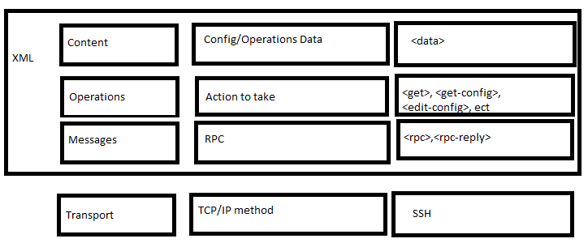

Model-Driven Programmability

gRPC is an open-source project started by Google to provide a modern remote procedure call framework that can be used in any environment.

## NETCONF
NETCONF = Network Configuration Protocol
NETCONF is just the connection and configuration protocol to a network device. If you need to send actual data, this is where YANG (Yet another next generation) steps in. With YANG you have a way to format your device data that you can push to your end devices.  
NETCONF uses SSH as its communication layer. It uses a client server model.  
NETCONF consists of four layers:
- Content layer
  - Actual config and notification data.
- Operations layer
  - defines a set of base protocol operations to retrieve and edit the config data
- Message layer
  - Provides a mechanism for encoding remote procedure calls.
- Secure transport layer
  - Ensures a secure and reliable transport between a client and a server.
Messages sent with NETCONf use RPCs.
- When you state an Message with a manager and an agent, The manager will send a RPC message with a unique ID. That unique ID will need to be in the REC-Reply in order for the manager to know that the agent and manager are talking about the same task.
- Here is a copy of the netconf protocol stack

- Here is a sample of the NETCONf communications
1. Connect to device and say hello (Manager > Agent)
2. Retrieve capabilities (Manager < Agent)
3. Investigate abailable models, determine which to use
4. Compose operation get-config 
5. send message rpc (Manager > Agent)
6. Retrieve RPC-Reply (Manager < Agent)
7. Process data

### NETCONF Operations
| Operation | Description | 
|-|-| 
\<get> | Retrieve running configurations and device state information.
\<get-config> | Retrieve all or part of the specified configuration data store.
\<edit-config> | Load all or part of a configuration to specified configuration data store.
\<copy-config> | Replace an entire configuration data store.
\<delete-config> | Delete a configuration data store.
\<commit> | Copy the candidate data store to the running data store.
\<lock>/\<unlock> | Lock or unlock the entire configuration data store system.
\<close-session> | Gracefully terminate the NETCONF session.
\<kill-session> | Forcibly terminate teh NETCONF session.

The NETCONF \<edit-config> operations supports several attributes
- merge
- replace
- create
- delete

### Python with NETCONF
- When using netconf inside of python you need to use ncclient. You will need to import manger module. This module will be used to connect to the device.
- You will often need to find out what capabilities the agent can support. There are a few different ways to accomplish this. One way is by pulling the data from the agent itself. The problem here is that the data you get back might be hard to read. Another option will be to go to the vendors website and read about it. This is my preferred method.
- Interface container will allow you configure the device or gather data about the config. The interface-state container will tell you stats about the interface.
- You will also likely want to use another module called "xmltodict" This does exactly what it says. converts xml to a dictionary. 

## YANG
YANG = Yet another next generation
YANG is a standardized data modeling language used to model configuration and state data. YANG is used to NETCONF. YANG is expressed in XML.
A native YANG model is created be a vendor for their equipment. often times one native model is not compatible with other vendors hardware/software.
A YANG module contains three types of statements:
- Module header statements describe the module and give information about it.
- Revision statements provides information about the history on the module.
- Definition statements are the body of the module, where the data model is defined.

YANG defines four types of nodes for data modeling:
- Leaf nodes
  - Leaf nodes only have one value of a specific type
  - Example is a single interface
- Leaf-list nodes
  - Leaf-list are a list of leaf nodes
  - example trunk interfaces
- Container nodes
  - Container is used to group related nodes within a subtree
  - Example would be stats about an interface. there are many different stats that you can grab from that one container.
- List nodes

Components that go into building the YANG data model
- Header information
- Imports and includes
- Type definitions
- Configurations and operation data declarations
- Action (RPC) & notification declaration
